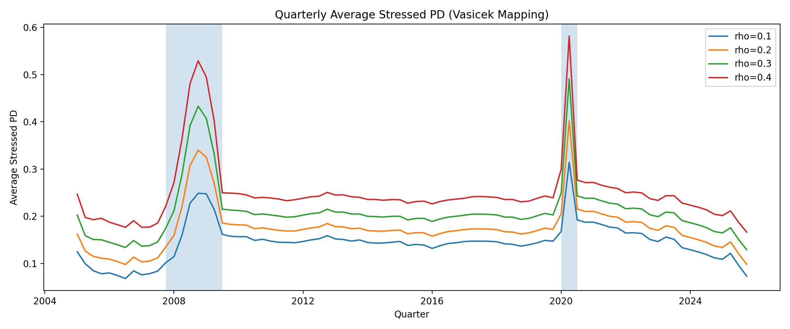
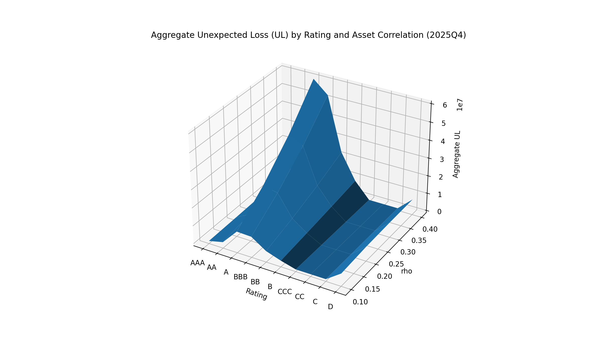

# Credit Risk Stress Testing (Basel Vasicek Framework)

A Python-based credit risk stress testing project implementing PD estimation, Basel Vasicek stress mapping, and facility-level Unexpected Loss (UL) analysis with visualization.

---

## Project Overview

This project performs end-to-end credit risk analysis using obligor-level Probability of Default (PD) and facility-level Exposure at Default (EAD) data.

Main components include:

- PIT PD aggregation by rating
- TTC PD construction
- Basel 99.9% stressed PD (Vasicek single-factor model)
- Facility-level Unexpected Loss (UL) computation
- Rating-level EAD aggregation
- Stress visualization (time series, histograms, 3D surfaces)

---

## 📂 Project Structure

```
Credit-Risk-Stress-Testing/
│
├── src/                # Core modeling & stress testing logic
├── docs/               # Sample output visualizations
├── data/               # Input datasets (ignored in repo)
├── outputs/            # Generated outputs (ignored in repo)
├── requirements.txt    # Python dependencies
└── README.md
```

---

## ⚙ System Design

The project follows a multi-stage processing pipeline:

1. Obligor-level PD aggregation
2. TTC PD construction
3. Basel Vasicek stress transformation
4. Facility-level UL computation
5. Rating-level aggregation
6. Visualization layer

### Data Flow

Obligor Panel  
→ Merge with Facility Data  
→ Stress Mapping (Vasicek)  
→ UL Calculation  
→ Rating Aggregation  
→ Plot Generation

### Architecture Separation

- `src/` — Core computation & modeling logic
- `docs/` — Sample visualization outputs
- `outputs/` — Auto-generated results (ignored in repo)
- `data/` — Input datasets (excluded from version control)

---

## Methodology

### TTC PD

Time-averaged PD per obligor:
PD_TTC = average(PD over time)

### Basel Stressed PD (Vasicek Mapping)

PD_stress = Φ((Φ⁻¹(PD_TTC) + √ρ · Φ⁻¹(0.999)) / √(1−ρ))

Where:

- ρ = asset correlation
- 0.999 = Basel confidence level
- Φ = standard normal CDF

### Unexpected Loss (Facility Level)

UL = EAD × LGD^DT × (PD_stress − PD_TTC)

LGD^DT is estimated from default events during stress periods (GFC / COVID).

---

## Tech Stack

- Python
- pandas
- numpy
- scipy
- matplotlib

---

## 🚀 How to Run

```bash
git clone https://github.com/YuyangZ1/Credit-Risk-Stress-Testing.git
cd Credit-Risk-Stress-Testing

pip install -r requirements.txt
python src/main.py

---

## 📊 Sample Outputs

### Stressed PD Time Series



### Aggregate UL Surface (2025Q4)


```
